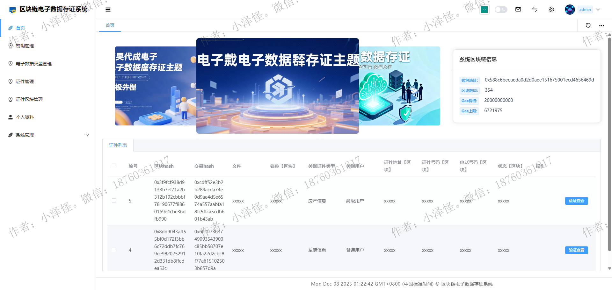
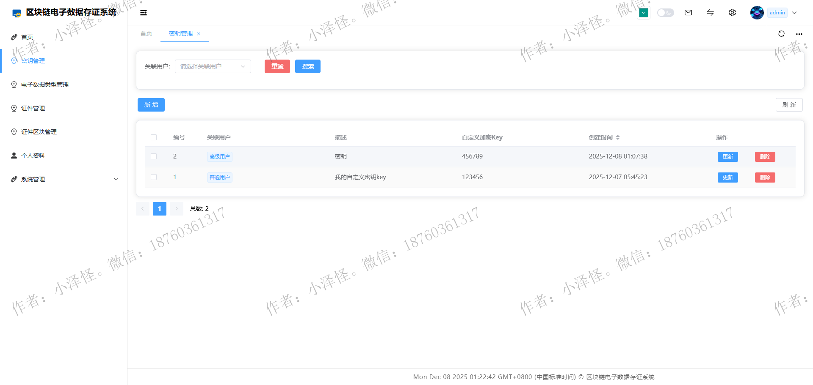
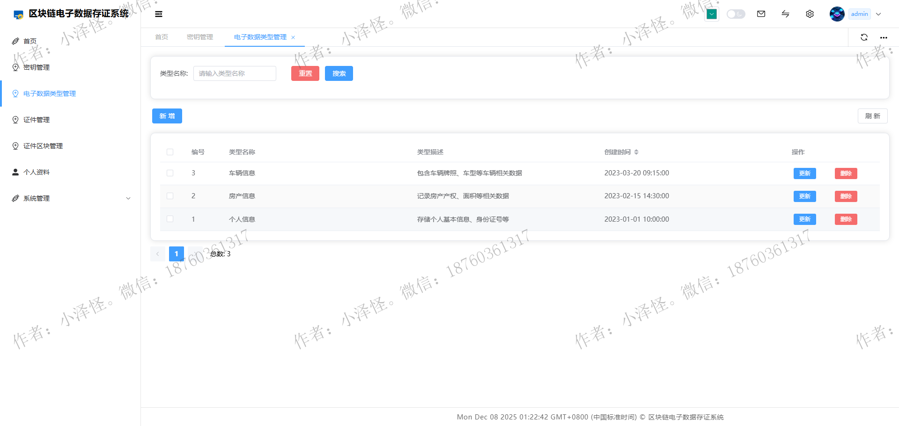
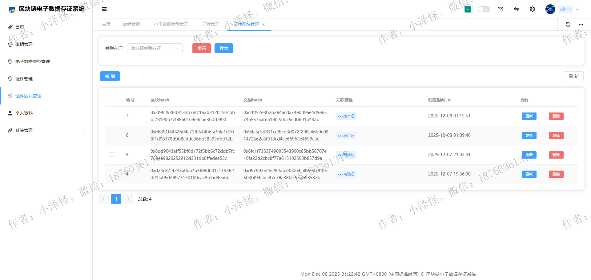
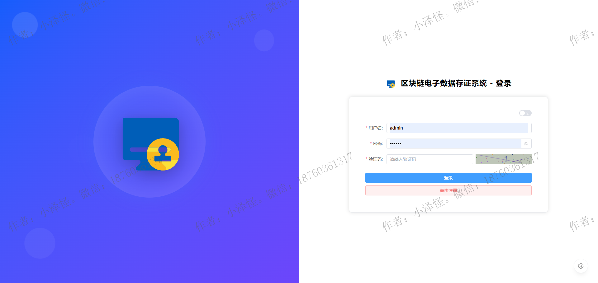
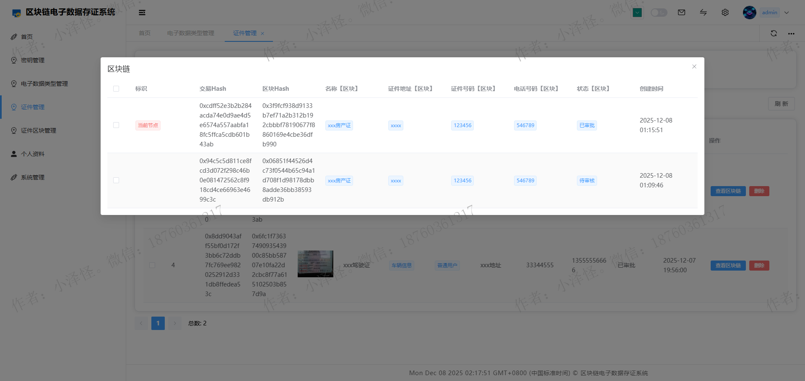
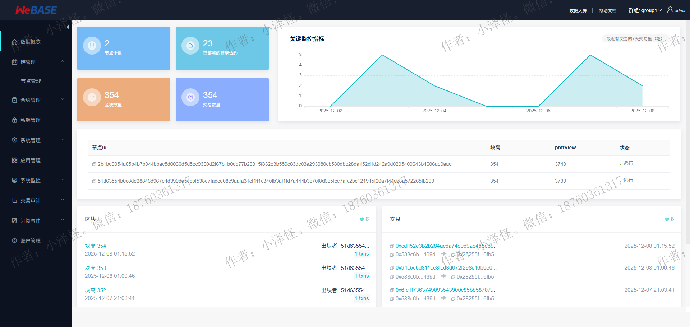

# 区块链电子数据存证系统-毕业设计

## 项目源码获取

    添加作者微信定制毕业设计

- 作者：小泽怪
- 微信号：18760361317

## 技术栈

### 前端技术栈（Vue3 全家桶）

- **核心框架**：Vue 3
- **UI 组件库**：Element Plus

### 后端技术栈（Java + Spring Boot）

- **开发框架**：Spring Boot

### 数据存储

- **关系型数据库**：MySQL 8.0

### 区块链

- **区块链平台**：FISCO BCOS
- **智能合约开发**：Solidity
- **合约管理**：Webase 平台

## 系统截图

